# AI-Powered Attendance & Warning System

**Stack:** n8n · Google Sheets · HTML/JS (Dashboard) · Gemini API · Google Calendar · Gmail

---

> ### IMPORTANT — Before Running This Workflow
>
> This workflow requires the following API credentials to be configured in n8n before execution:
>
> - **Google Sheets OAuth2** — for reading and writing attendance data
> - **Google Calendar OAuth2** — for creating 5 PM warning meetings
> - **Gmail OAuth2** — for sending personalized warning emails
> - **Google Gemini API Key** — for AI-generated email drafting
>
> Please replace all credentials in the workflow with your own API keys. The workflow will not run without valid credentials configured in n8n's Credential settings.
>
> **AI Model used:** `models/gemini-3-flash-preview` via Google Gemini API

---

## Setup Instructions

Follow these steps before running the workflow for the first time.

### Step 1 — Create Google Sheet

1. Go to [sheets.google.com](https://sheets.google.com) and create a new spreadsheet
2. Name it `Attendance System`
3. In **Sheet1** (default tab), add these headers in row 1:

| A | B | C | D | E | F |
|---|---|---|---|---|---|
| Employee ID | Name | Date | Check-In | Check-Out | Late Flag |

4. Click the `+` button at the bottom to add a new sheet, rename it `Sheet2`, and add these headers in row 1:

| A | B | C | D | E | F |
|---|---|---|---|---|---|
| Employee ID | Name | Monthly Late Count | Last Warning Date | Month/Year | Excused |

5. Copy the spreadsheet URL from your browser

### Step 2 — Update Spreadsheet URL in Workflow

After importing the workflow JSON into n8n, find and update the URL in these two nodes:

- **"Append row in sheet"** (Sheet1 node) — replace the Document URL with your spreadsheet URL
- **"Append row in sheet1"** (Sheet2 node) — replace the Document URL with your spreadsheet URL

### Step 3 — Create Google Calendar

1. Go to [calendar.google.com](https://calendar.google.com)
2. Click `+` next to "Other calendars" → **Create new calendar**
3. Name it `Attendance System`
4. In the Google Calendar node inside n8n, select this calendar from the dropdown

### Step 4 — Configure Credentials in n8n

Go to **n8n → Credentials** and add the following:

| Credential | Where to get it |
|---|---|
| Google Sheets OAuth2 | Google Cloud Console → OAuth 2.0 Client |
| Google Calendar OAuth2 | Same OAuth 2.0 Client as above |
| Gmail OAuth2 | Same OAuth 2.0 Client as above |
| Google Gemini API | https://aistudio.google.com → Get API Key |

Replace all credentials in the workflow nodes with your own.

### Step 5 — Trigger the Workflow

1. Activate the Webhook node in n8n (click "Listen for Test Event")
2. Send your attendance Excel file via curl:

```bash
curl -X POST http://localhost:5678/webhook-test/attendance -F "data=@/path/to/your/attendance.xlsx"
```

3. The workflow will process the file and output results to your Google Sheet, Calendar, and Gmail

---

## 1. Architecture Diagram

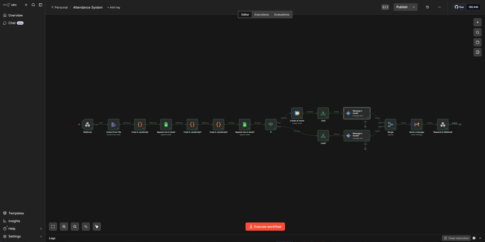

https://github.com/user-attachments/assets/86b7f2a8-3c81-4629-be8e-6f662cce31e3

```
[HR uploads .xlsx]
        │
        ▼
┌─────────────────┐
│  Webhook Trigger │  POST /attendance
│  (n8n)          │
└────────┬────────┘
         │
         ▼
┌─────────────────────┐
│ Extract from File   │  Parses .xlsx → JSON rows
│ (n8n XLSX node)     │
└────────┬────────────┘
         │
         ▼
┌──────────────────────────────────────────────────┐
│ Code Node — Transform                            │
│ - Groups rows by Employee + Date                 │
│ - Earliest IN punch = Check-In                   │
│ - Latest OUT punch = Check-Out                   │
│ - Check-In after 11:00 AM → Late Flag = YES      │
└────────┬─────────────────────────────────────────┘
         │
         ▼
┌────────────────────────┐
│ Google Sheets — Sheet1 │  Appends daily processed records
│ (Daily Records)        │
└────────┬───────────────┘
         │
         ▼
┌──────────────────────────────────────────┐
│ Code Node — Filter & Aggregate           │
│ - Filters only Late Flag = YES rows      │
│ - Counts late days per employee/month    │
│ - Assigns strike level (1, 2, or 3+)    │
└────────┬─────────────────────────────────┘
         │
         ▼
┌────────────────────────┐
│ Google Sheets — Sheet2 │  Appends monthly strike counter
│ (Strike Counter)       │
└────────┬───────────────┘
         │
         ▼
┌──────────────────┐
│   IF Node        │  Monthly Late Count >= 3?
└──┬───────────┬───┘
   │ TRUE      │ FALSE
   ▼           ▼
┌──────────┐ ┌────────────────┐
│ Google   │ │ Gemini AI Node │
│ Calendar │ │ 1st/2nd strike │
│ Create   │ │ warning email  │
│ 5 PM     │ └───────┬────────┘
│ meeting  │         │
└────┬─────┘         │
     │               │
     ▼               │
┌──────────────┐     │
│ Gemini AI    │     │
│ 3rd strike   │     │
│ final warning│     │
│ + calendar   │     │
│ link         │     │
└──────┬───────┘     │
       │             │
       └──────┬──────┘
              ▼
       ┌─────────────┐
       │ Merge Node  │  Combines both branches
       └──────┬──────┘
              ▼
       ┌─────────────┐
       │ Gmail Node  │  Sends personalized warning email
       └──────┬──────┘
              ▼
       ┌──────────────────────┐
       │ Respond to Webhook   │  Returns success JSON to caller
       └──────────────────────┘
```

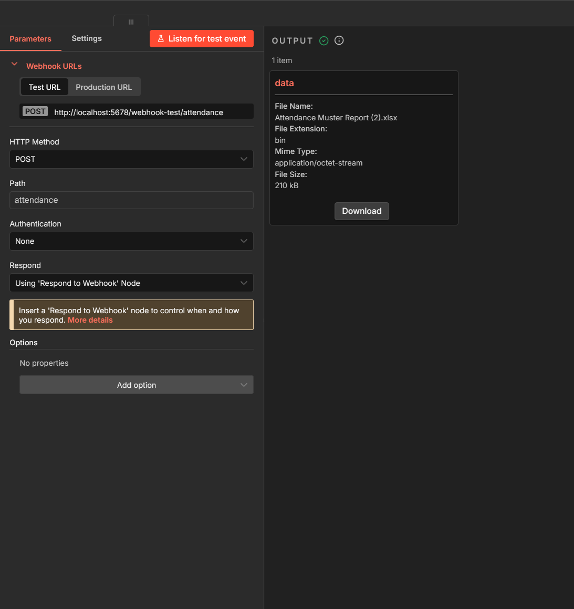

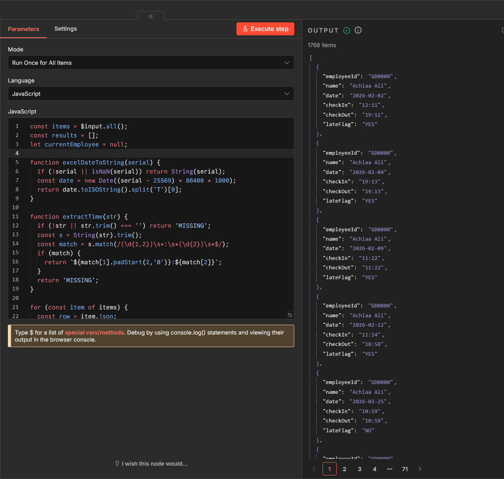

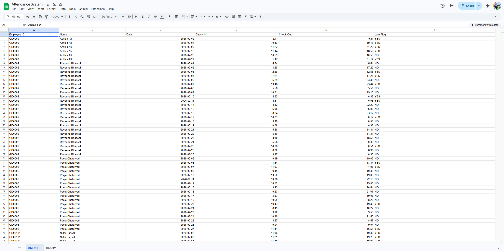

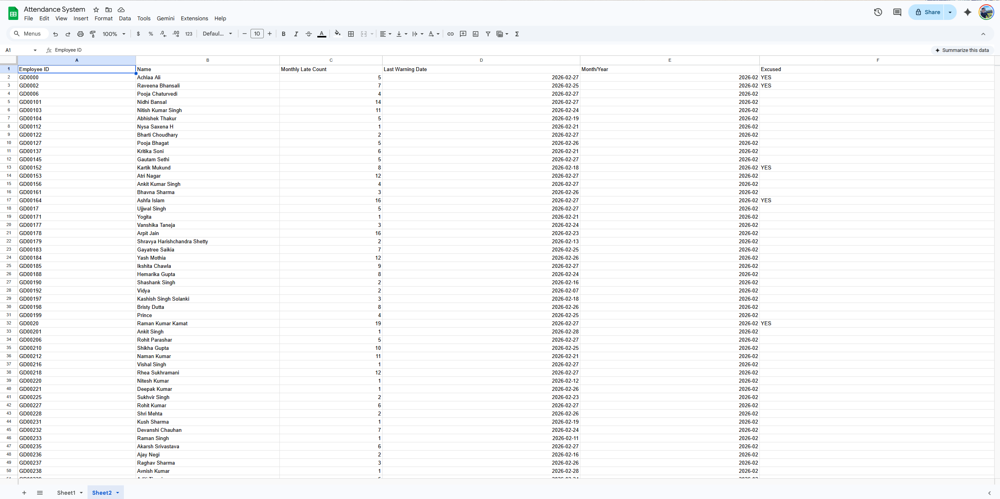

---

## 2. Edge Case Handling — Missing OUT Punch

**Detection:**
In the Code node, after grouping punch records by employee and date, the system checks whether any OUT punch exists for that day:

```javascript
const checkOut = record.outTimes.length > 0
  ? record.outTimes.sort().reverse()[0]
  : 'MISSING';
```

**Fallback Behavior:**
- If no OUT punch is found, `Check-Out` is set to `"MISSING"` in the daily record
- The row is still written to Sheet1 with `Check-Out = MISSING`
- The Late Flag is still evaluated based on Check-In time alone — a missing OUT punch does not block the late detection logic
- The employee's late count is still incremented if Check-In was after 11:00 AM

**What gets written to Sheet1:**

| Employee ID | Name | Date | Check-In | Check-Out | Late Flag |
|---|---|---|---|---|---|
| GD0001 | John Doe | 2026-02-05 | 11:30 | MISSING | YES |

**Alerts:**
The `MISSING` value in the Check-Out column serves as a visual flag for HR managers reviewing Sheet1. In a production extension, a separate filter could identify all `MISSING` rows and send an alert email to the HR manager at end of day.

---

## 3. Scalability Plan — 500 Employees, 5 Office Locations

**Throughput:**
The current workflow processes all employees sequentially in a single run. For 500 employees, the bottleneck is the AI email generation node. This is addressed by:

- Adding a **Wait node** (4–5 seconds) before the AI node to respect API rate limits
- Using **batch processing** — splitting the employee list into batches of 50 using n8n's Split in Batches node, processing each batch in parallel sub-workflows
- Estimated processing time for 500 employees: ~10–15 minutes per run

**Data Partitioning:**
Two approaches depending on requirement:

- **Single spreadsheet with location column:** Add a `Location` column to both Sheet1 and Sheet2. Filter by location in the Code node to apply location-specific rules. Simple to maintain.
- **Separate spreadsheets per location:** Each office gets its own Google Sheet. The webhook accepts a `location` parameter and routes to the correct sheet. Better for data isolation and access control.

**Location-Based Rules:**
Different offices may have different shift start times. This is handled by adding a `shiftStartTime` lookup table in the Code node:

```javascript
const shiftTimes = {
  'Delhi': '11:00',
  'Mumbai': '10:30',
  'Bangalore': '10:00',
  'Hyderabad': '11:00',
  'Chennai': '10:30'
};
const lateThreshold = shiftTimes[employeeLocation] || '11:00';
```

**Infrastructure:**
- Move from n8n self-hosted to **n8n Cloud** for reliability and uptime
- Use **PostgreSQL** instead of Google Sheets for better query performance at scale
- Add a **error handling node** after each critical step to catch failures and notify the admin
- Schedule the workflow to run automatically at **end of each business day** using n8n's Cron trigger instead of a manual webhook

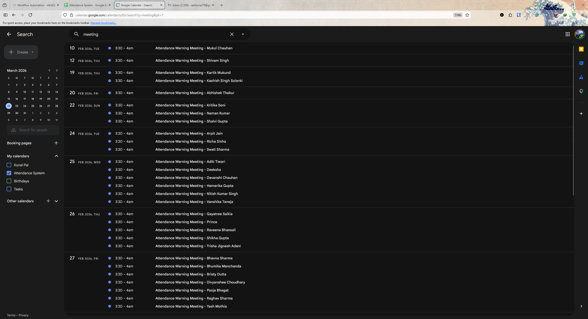

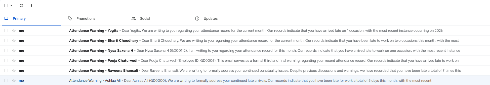

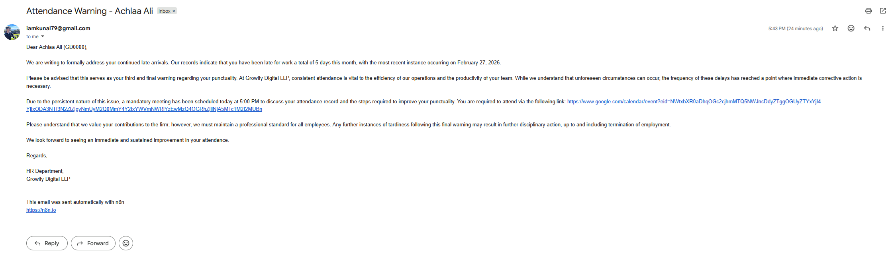

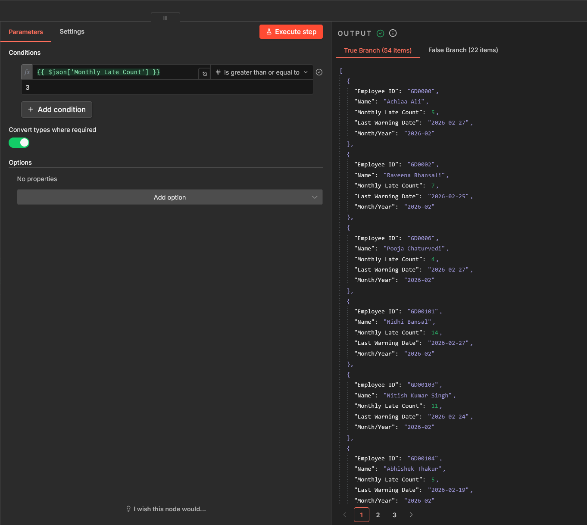

---


## 4. Real-Time HR Dashboard

To provide immediate, actionable insights for HR managers, a secondary n8n workflow was created to serve a live, read-only HTML dashboard.

**Features Include:**

* **Live Data:** Served directly from Google Sheets via an n8n GET Webhook.
* **Analytics Cards:** Summarizes Total Employees, Late arrivals, On-Time, At-Risk (2 strikes), and Critical (3+ strikes).
* **Dynamic Sorting:** Managers can sort the late employee table by name, late count, or last warning date.
* **Auto-Refresh:** The UI automatically polls for updated data every 60 seconds.
* **"Mark Excused" Override:** A manual action button that sends a POST request back to a secondary n8n webhook (`/excuse-employee`). This triggers a Google Sheets "Update Row" node, matching on the `Employee ID` to change their status to "YES" in the `Excused` column.

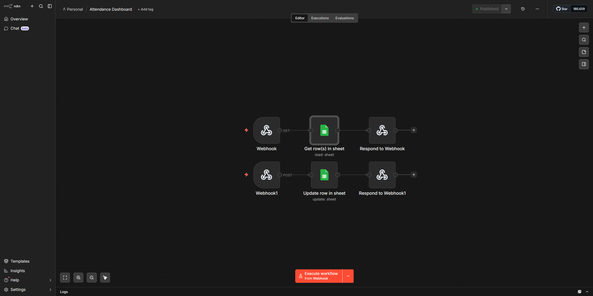

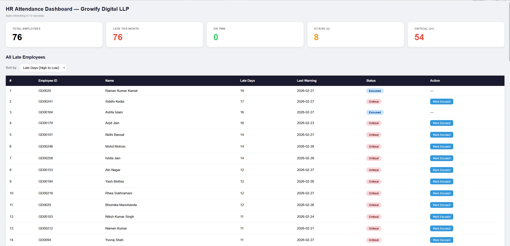


https://github.com/user-attachments/assets/650ae76e-1624-4f38-9d53-5fd79dd1331c
<<<<<<< HEAD
=======

>>>>>>> 6946a4baa15549976db7ec1fbb4e2633ee9e4861


*(Note: The Dashboard HTML and specific webhook routes are included in the provided JSON export).*